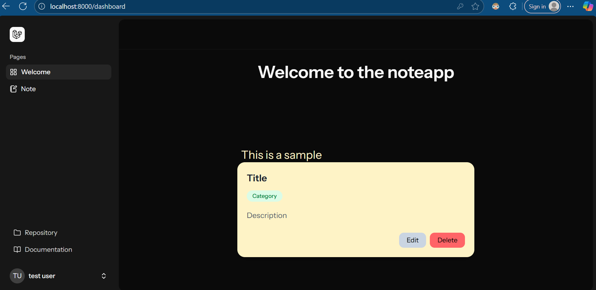
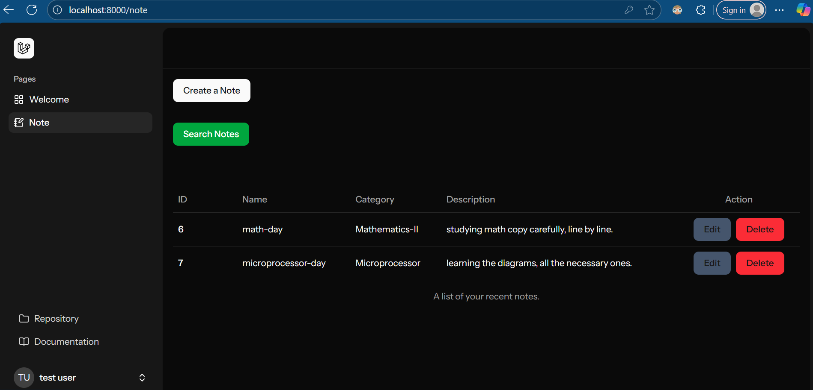
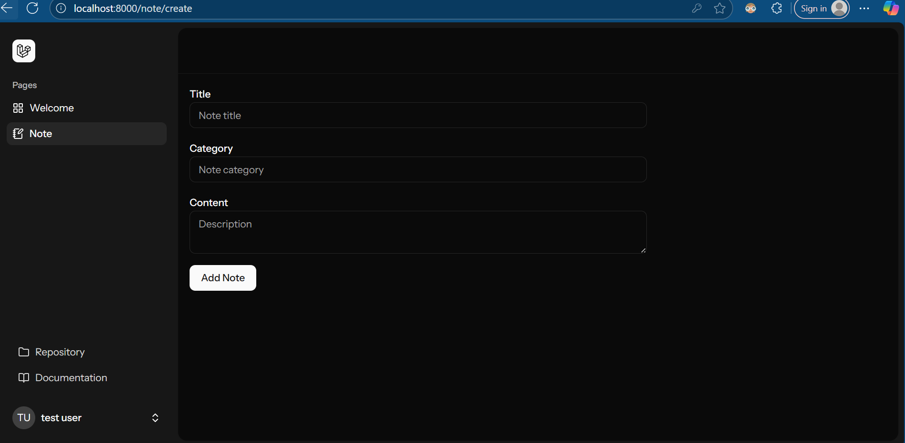

# NoteApp | Simple CRUD Note-Taking App

Introduction

NoteApp is a simple application built with Laravel 12. It allows users to create, read, update, and delete notes, and also provides user registration and login functionality.  

Screenshots

  
  
  

Installation

1. Clone the repository and navigate to the project folder:

   ```powershell
   git clone https://github.com/tvaijoo/CRUD-note-taking-app.git
   cd CRUD-note-taking-app
   ```
2. Install PHP dependencies:

   ```powershell
   composer install
   ```

3. Set up your environment

Start XAMPP and make sure your server and database are running.

Create the .env file by creating manually.

4. Generate the key:

```powershell
php artisan key:generate
Run database migrations:
```

```powershell
php artisan migrate
```

5. Start the development server:

```powershell
php artisan serve
```

6. Open your browser and go to:

```powershell
http://localhost:8000
```

Tech Stack

-Frontend: React, TypeScript, Tailwind CSS, Shadecn UI, Inertia.js

-Backend: Laravel 12

-Database: SQLite

Features

-User registration and login

-Create, read, update, and delete notes

-Categorize notes

-Search notes by title


